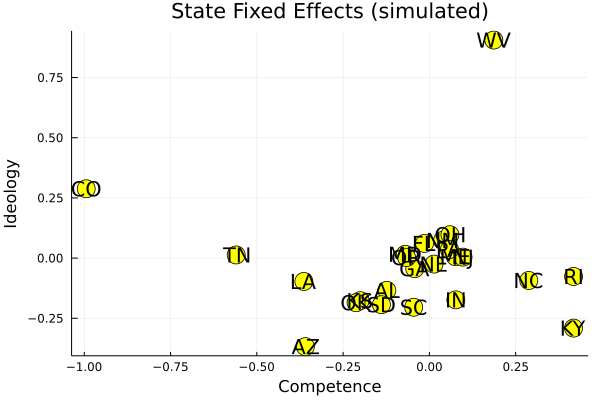
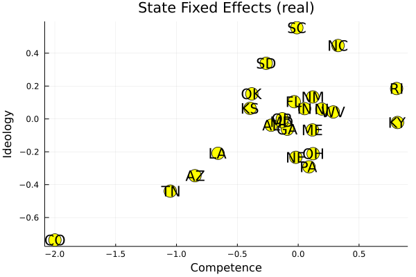
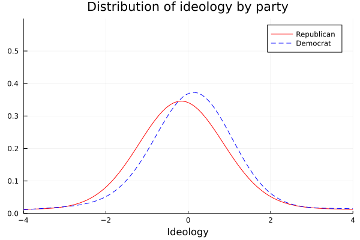
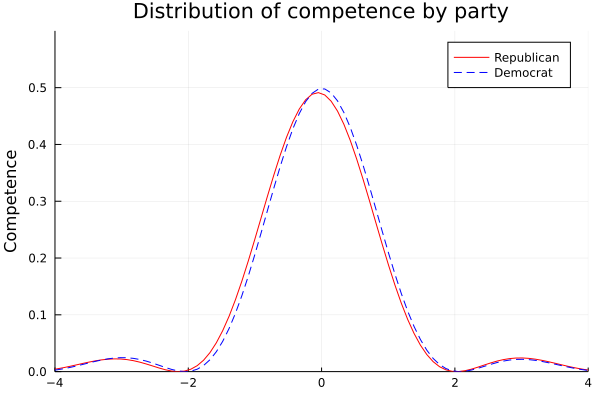

# Replication of Sieg and Yoon (2017)

> This replication study was part of our evaluation for the course [Numerical Methods](https://floswald.github.io/NumericalMethods/) at SciencesPo Paris in Spring 2021

In this replication study, we take advantage of Julia in order to model dynamic games by using a standard semi-parametric approach. Please note that while we find almost identical results in terms of model solutions for the numerical values, the differences in simulation results are larger.

As the authors themselves explain in their Readme file accompanying their code, this is because a randomly drawn politician can be classified as a different type of governor even with small differences in election standards.

You will find our documentation here.

Authors: Agathe Denis ([@agathedenis](https://github.com/agathedenis/)), Victor Ho ([@vho97](https://github.com/vho97/)) and Xuan Zhu ([@xzhu19](https://github.com/xzhu19/))

## Why this paper

We choose to replicate the paper with our practical knowledge in Julia. The theoretical framework and analytical approach of this paper seem suitable for many features of Julia environment. It is a game theory paper in which the authors define a model with utility functions, value functions and probabilities and solve with dataset based on all gubernatorial elections ranging from 1950 to 2011 in the U.S. The identification and estimation processes involves various optimization problems and many packages in Julia are beneficial for the analysis. Given the large size of dataset, Julia also enjoys the advantage of faster operation and shorter code compared to Stata and Matlab used by the original paper.

Throughout the process of replicating the paper and discovering different programming features in distinct environment, our computational skills as well as general understanding of numerical methods have been significantly improved. This has allowed us to learn how to develop packages and work as a team with version control on GitHub, which is hugely beneficial and not Julia-specific. 

## Summary of the paper

In their paper titled *Estimating Dynamic Games of Electoral Competition to Evaluate Term Limits in U.S. Gubernatorial Elections*, Sieg and Yoon develop a model of political competition in the American gubernatorial elections and offer a comprehensive welfare analysis of term limits. 

According to the theoretical literature in political economy, electoral competitions are usually modelled as dynamic games with asymmetric information and perfect monitoring. The primary objective of this paper is therefore to find feasible solution to identify and estimate these types of dynamic games. This paper proposes to use standard semi-parametric techniques to model a class of dynamic games. The empirical approach provides novel quantitative insights into the trade-off that voters face between ideology and competence, the differences of those among parties and states, as well as the differences in preferences between political candidates and voters. Moreover, the authors aim to quantitatively investigate the relative importance of term limit and offer a comprehensive analysis of its impact on electoral outcomes and voters? welfare.

The empirical results of this paper indicate that voters are willing to accept considerable trade-offs between ideology and ability and governors enjoy significant advantages as a result of maintaining position. As a result to this, the chance of reelection provides strong incentives for moderate governors to shift closer to the center of the ideological spectrum during their first term in office. As for the welfare effect of term limits, the authors show that term limits may be welfare improving if the tenure effects are negative and sufficiently large.

## Instructions and results

The data used contains all gubernatorial elections between 1950 and 2011 in the United States, restricted mainly to the 24 states that have (or had until recently) a 2-term limit.

We focused on replicated the first-stage estimates of ideology and competence.

In order to do so, the authors use a multivariate regression using state fixed effects related to ideology and competence (described in the table below) with the command mvregress and a cell array on Matlab. Two issues here prevented us from using the command lm of the GLM.jl package: the outcome variable has two dimensions and we could not use 3D arrays as an equivalent to cell arrays. After much online research and tries, it has been recommended for similar problems to try to run two regressions independently for each dimension of the outcome variable. As the two dimensions are obviously correlated (economic growth is related to both competence and ideology for example), we find completely different results.

Below are the differences between our approach and the authors'.




Then, the next step is to extrapolate the distribution of ideology and competence by party. Using the functions given by the authors, which seek a normal fit, we use optimization packages in order to find the distribution that fits the data. Below are the distributions, which are virtually identical to the authors'.




In short, these are the results for the first part, which estimates the state fixed effects:
                                       | Estimate | SE <br/>
---                                   | ---            | --- <br/>
Ideology                         |                 |<br/>
Expenditures                  | 1              |<br/>
Taxes                             | 0.703        | 0.026<br/>
Economic growth           | -1.047      | 0.006<br/>
Debt costs                     | 0.111        | 0.005<br/>
Workers' compensation | -0.018      | 0.006<br/>
Competence                  |                 |<br/>
Economic growth           | 1              |<br/>
Debt costs                     | -0.400       | 0.094<br/>
Workers' compensation | -0.060       | 0.029<br/>

What remains to be done relates to the simulated method of moments, which uses the data points to extrapolate voters' value functions, so the benefits of holding office and the tenure effect can be estimated. We prepared most of the modules required to do so: they are available in the repository.

```@autodocs
Modules = [Replication_of_Sieg_Yoon_2017]
```

end
